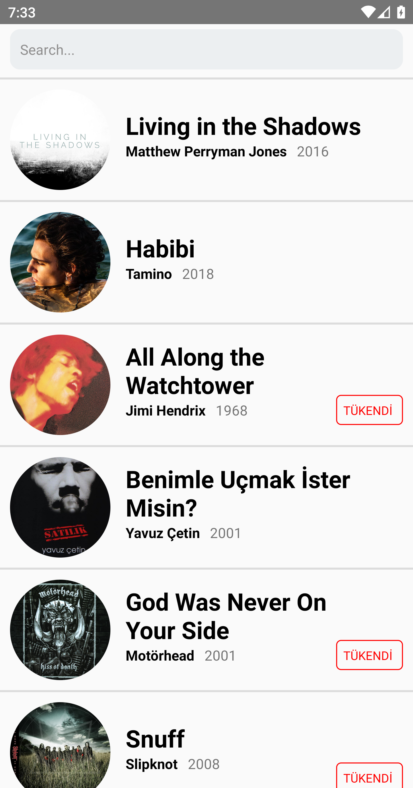

# README.md

To run my app, you can import "src" and "index.js" files to your project.

I developed music app using react native framework. While developing this app, I used "state" variable and these custom components which names are songCard and searchBar. 

-Screenshots from my app-

  
  

